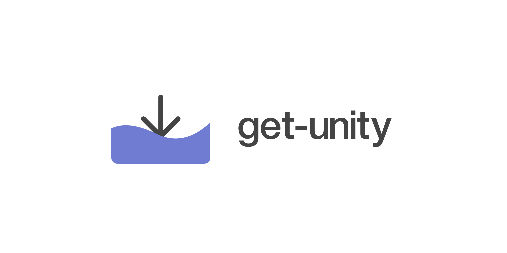

# 

> 🕹 Command line tool for getting the download URL for the latest or specific version of Unity.

[](https://www.npmjs.org/package/get-unity)
[](https://travis-ci.com/neogeek/get-unity)

## Install

```bash
$ npm install -g get-unity
```

## Usage

### Get the download URL of the latest major release of Unity.

```bash
$ get-unity
```

### Get the download URL of the latest minor release of Unity.

```bash
$ get-unity 2019.x
```

### Get the download URL of the latest patch release of Unity.

```bash
$ get-unity 2019.2.x
```

### Get the download URL of the version found in ProjectSettings/ProjectVersion.txt

```bash
$ get-unity --file=ProjectSettings/ProjectVersion.txt
```

### Exporting URL to an enviroment variable.

```bash
$ UNITY_URL=$(get-unity --file=ProjectSettings/ProjectVersion.txt)
$ echo $UNITY_URL
```

## API

### `getUnityUrls`

```javascript
const { getUnityUrls } = require("get-unity");

getUnityUrls("2019").then(urls => console.log(urls));

// https://download.unity3d.com/download_unity/5f859a4cfee5/MacEditorInstaller/Unity-2019.2.11f1.pkg
```

### `parseVersionFromString`

```javascript
const { parsers } = require("get-unity");

console.log(
  parsers.parseVersionFromString(`m_EditorVersion: 2019.2.9f1
m_EditorVersionWithRevision: 2019.2.9f1 (ebce4d76e6e8)`)
);

// 2019.2.9f1
```
